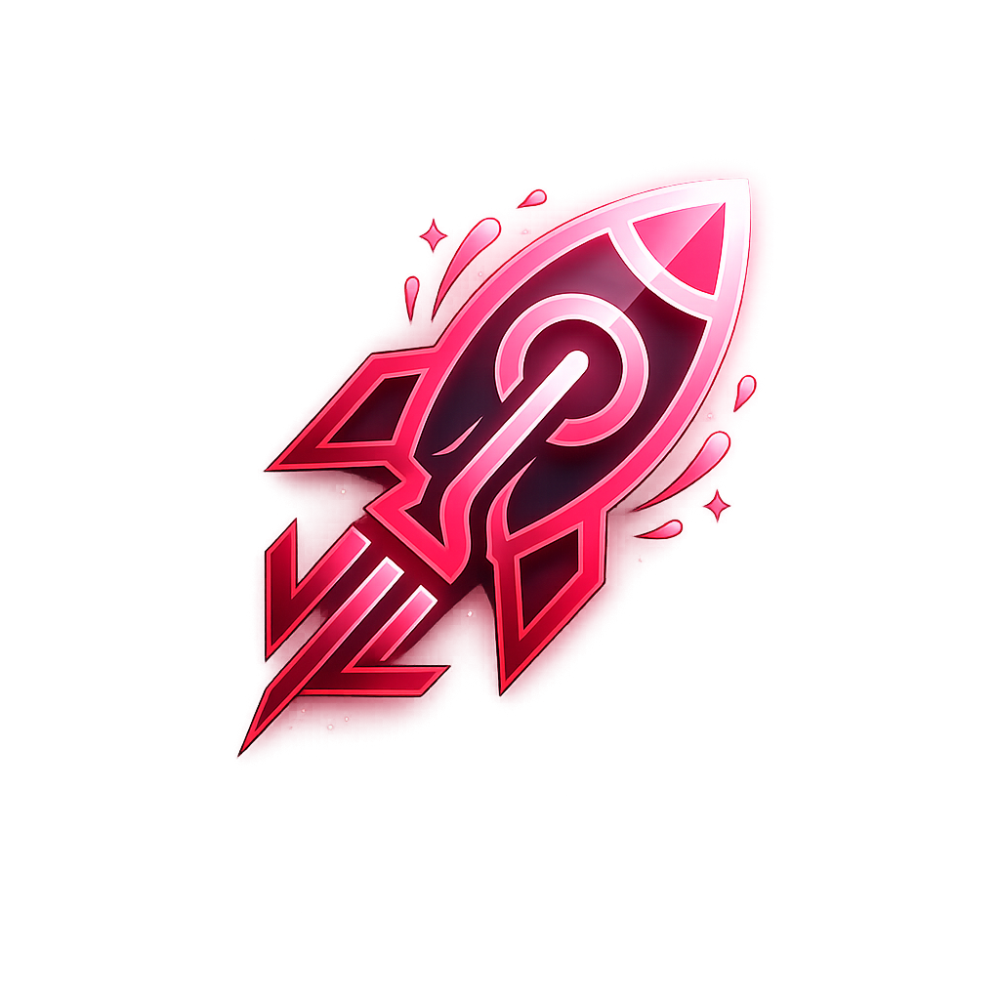

#  Ventrixa — AI Website Generation Platform

<div align="center">

**Transform ideas into production-ready websites in seconds.**

[](#)
[](#)
[](#)
[](#)
[](#)
[](LICENSE)

**Built with:** Next.js · React · TypeScript · Tailwind CSS · OpenAI · Ollama

</div>

---

## 📋 Description

Ventrixa is an AI-powered website builder that makes creating web pages incredibly simple. Instead of spending hours dragging and dropping components or writing complex code, you just describe what you need. Provide a brief description, select a few industry keywords, and pick your styling options. Ventrixa will instantly turn those inputs into a beautiful, ready-to-use website layout.

---

## ✨ Core Features

* 🪄 **Smart AI Wizard** — Create multi-page layouts just by typing a natural-language description.
* 🎨 **Adaptive Color System** — Automatically hashes and compiles matching light and dark themes.
* 🛠️ **Real-Time Editor** — Tweak styling, change text, and edit components directly in your browser.
* 📦 **Instant Zip Export** — Download your complete website as a production-ready Next.js project.
* 🤖 **Ollama & OpenAI Support** — Choose between a free local AI (Ollama) or OpenAI APIs.
* 📈 **Built-in SEO** — Generates search-engine optimized titles, meta descriptions, and keywords automatically.

---

## 🛠️ The Tech Stack

* **Frontend**: [Next.js 16 (App Router)](https://nextjs.org/), [React 19](https://react.dev/), [Tailwind CSS v4](https://tailwindcss.com/), Zustand (State), Framer Motion (Animations).
* **Backend**: Next.js Server Actions & Route Handlers, NextAuth (Secure JWT Authentication).
* **Database**: Dual-Mode Architecture using MongoDB (Mongoose) with a seamless fallback to a local JSON file (`src/data/mockDb.json`) for zero-config setups.
* **AI Engines**: OpenAI API or local Ollama servers (supports models like Llama 3).

---

## 📁 Project Structure

Here are the key files and folders you should know about:

```text
ventrixa/
├── public/                 # Static assets (logos, icons, images)
├── src/
│   ├── app/                # Pages, dashboard wizard, and API endpoints
│   ├── components/         # Reusable UI modules & animation components
│   ├── data/               # Local mock DB (runs when MONGODB_URI is empty)
│   ├── lib/                # Database configurations & AI compiler engines
│   └── models/             # Mongoose database schemas
├── .env.example            # Environment variables template
├── Dockerfile              # Docker container configuration
└── README.md               # Project guide (you are here!)
```

---

## ⚙️ Configuration & Environment Variables

Copy the `.env.example` file to `.env.local` in the project root:

```bash
cp .env.example .env.local
```

Configure the variables below as needed:

| Variable | What it does | Example |
|----------|--------------|---------|
| `MONGODB_URI` | **Optional** – Connection string for MongoDB Atlas. If left blank, the app stores data in `src/data/mockDb.json`. | `mongodb+srv://...` |
| `NEXTAUTH_SECRET` | Key used to secure session cookies. | `your-secret-key-here` |
| `NEXTAUTH_URL` | The URL of your local environment. | `http://localhost:3000` |
| `OPENAI_API_KEY` | **Optional** – OpenAI API Key. If left blank, the app will try to use a local Ollama instance. | `sk-proj-xxxx...` |
| `OPENAI_API_BASE_URL` | Base URL of your local Ollama API server. | `http://127.0.0.1:11434/v1` |
| `AI_MODEL` | The AI model you want to run. | `gpt-4o-mini` or `llama3` |

---

## 🚀 Easy Quick Start

Anyone can get Ventrixa up and running locally in four easy steps:

### 1. Clone the Repository
```bash
git clone https://github.com/jaymore4501/Ventrixa.git
cd Ventrixa
```

### 2. Install Dependencies
```bash
npm install
```

### 3. Setup the Environment File
Create a new file named `.env.local` using the template. If you don't have a MongoDB cluster or an OpenAI key, you can leave those blank. The app will automatically fall back to local JSON storage and local Ollama inference!

### 4. Run the Dev Server
```bash
npm run dev
```
Open **[http://localhost:3000](http://localhost:3000)** in your browser to start building!

---

## 🐳 Running with Docker

You can easily run Ventrixa as a containerized app:

```bash
# 1. Build the Docker image
docker build -t ventrixa:latest .

# 2. Run the container using your local env settings
docker run -d -p 3000:3000 --env-file .env.local --name ventrixa_container ventrixa:latest
```
Open **[http://localhost:3000](http://localhost:3000)** to view your containerized app.

---

## 📄 License

This project is licensed under the MIT License — see the [LICENSE](LICENSE) file for details.

---

Enjoy building beautiful AI-generated websites with Ventrixa! 🚀
